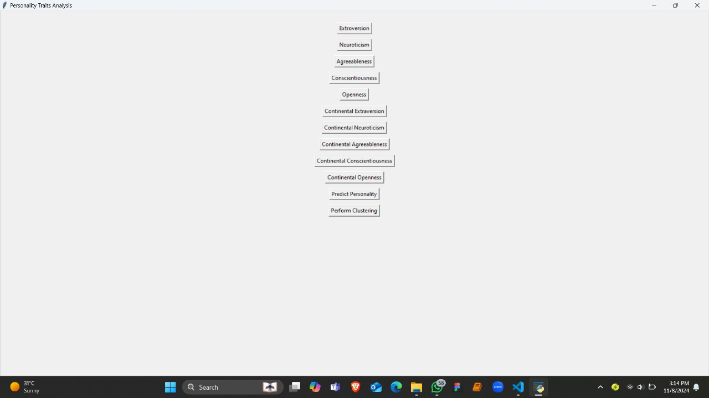
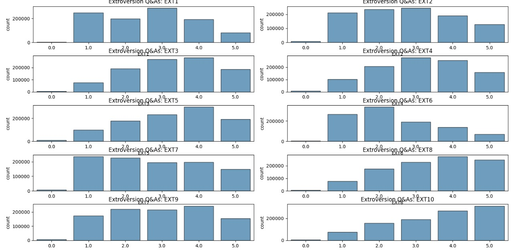
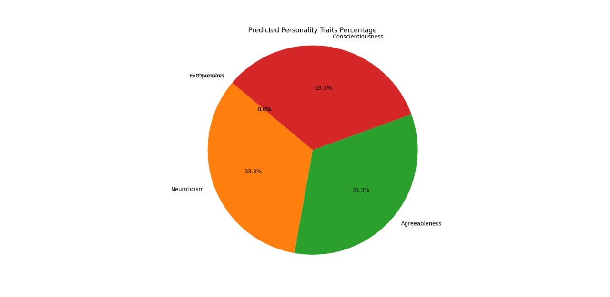
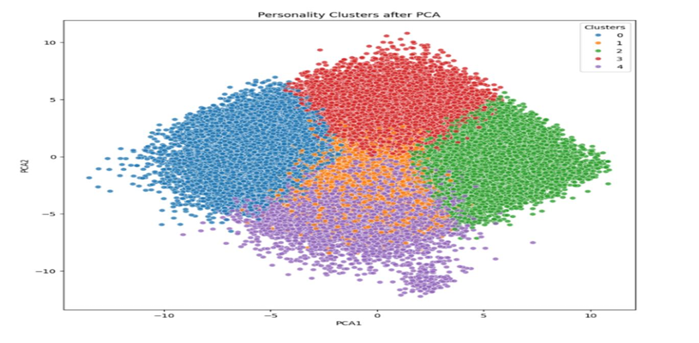
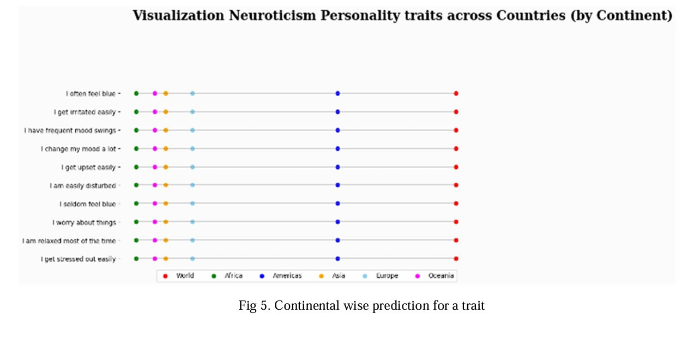

# 🧠 Human Behaviour Prediction Using Personality Traits

> A published machine learning research project that analyzes human behaviour using the Big Five Personality Traits through Principal Component Analysis (PCA), K-Means clustering, and an interactive Tkinter desktop application.

---

## 📖 Research Publication

This project is based on our published research paper.

**Title:**
**Predicting Human Behaviour with Human Traits**

**Journal:**
Grenze International Journal of Engineering and Technology (GIJET), Volume 11, Issue 2, 2025

🔗 **Research Paper**
https://thegrenze.com/search?fn=223_22.pdf&name=Predicting+Human+behaviour+with+Human+Traits&id=6095&association=GRENZE&journal=GIJET&year=2025&volume=11&issue=2

---

## 📸 Screenshots

### Application Home



### Personality Questionnaire



### Personality Prediction



### K-Means Clustering



### Continental Analysis



## 📌 Overview

Understanding human personality plays a significant role in psychology, human resource management, education, and marketing. This project applies Machine Learning techniques to analyze personality traits based on the Big Five (OCEAN) model.

Principal Component Analysis (PCA) is used to reduce feature dimensions, while K-Means clustering identifies groups of individuals with similar behavioural characteristics. The project also includes a Tkinter-based graphical interface for visualization and personality assessment.

---

## ✨ Features

- Data preprocessing and cleaning
- Principal Component Analysis (PCA)
- K-Means clustering
- Personality trait visualization
- Continental personality comparison
- Interactive Tkinter GUI
- Real-time personality assessment
- Research publication included

---

## 🛠 Technologies Used

| Technology | Purpose |
|------------|---------|
| Python | Programming Language |
| Pandas | Data Processing |
| NumPy | Numerical Computing |
| Matplotlib | Visualization |
| Scikit-Learn | Machine Learning |
| Tkinter | Desktop GUI |

---

## 🧩 Machine Learning Workflow

Dataset

↓

Data Cleaning

↓

Feature Scaling

↓

Principal Component Analysis (PCA)

↓

K-Means Clustering

↓

Visualization

↓

GUI-Based Personality Prediction

---

## 📂 Project Structure

```text
human-behaviour-prediction-personality-traits/

├── docs/
├── screenshots/
├── src/
├── requirements.txt
├── README.md
└── LICENSE
```

---

## 🚀 Installation

```bash
git clone https://github.com/arthibalaji05/human-behaviour-prediction-personality-traits.git

cd human-behaviour-prediction-personality-traits

pip install -r requirements.txt

python personality_prediction.py
```

---

## 📊 Results

The proposed system successfully:

- Performs personality trait analysis
- Groups individuals using K-Means clustering
- Reduces feature dimensions with PCA
- Visualizes behavioural patterns
- Predicts dominant personality traits through an interactive GUI

---

## 📸 Screenshots

*


---

## 🔮 Future Enhancements

- Streamlit web application
- Flask REST API
- Deep Learning models
- Explainable AI (SHAP)
- Cloud deployment
- Mobile application

---

## 👩‍💻 Author

**Arthi Balaji**

- GitHub: https://github.com/arthibalaji05

---

## ⭐ If you found this project useful, please consider giving it a star!
